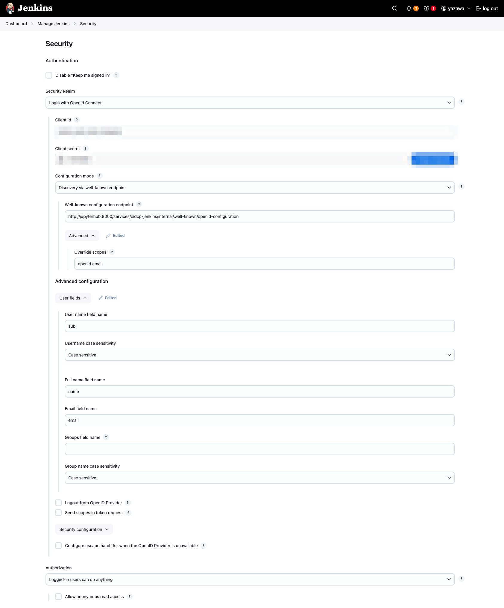
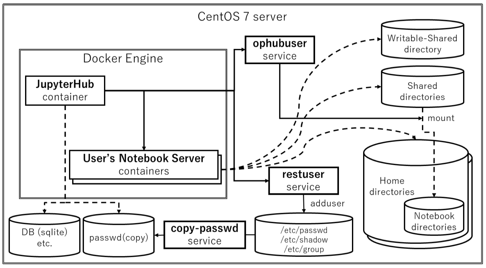
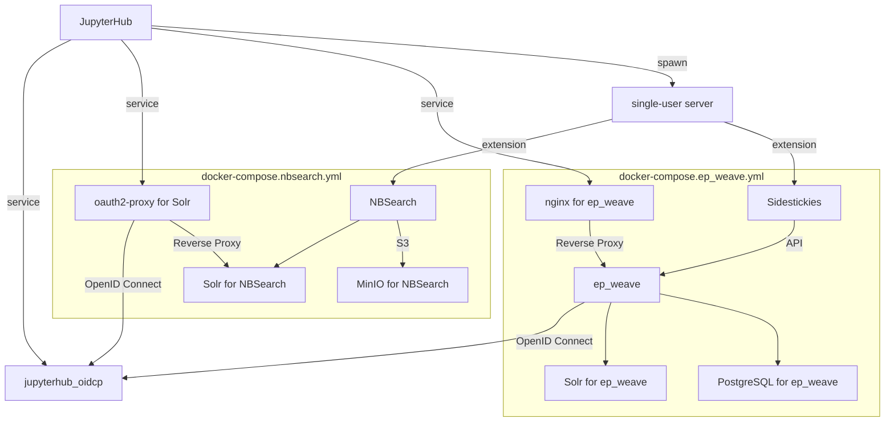

# OperationHub

A simple JupyterHub for *Literate Computing for Reproducible Infrastructure*.

OperationHub helps you provide a multi-user notebook environment on a single server
for a small operation team to start *Literate Computing for Reproducible Infrastructure*.

It serves the following features:

- A multi-user notebook environment by JupyterHub on a single server
- Each user environment is isolated by a docker container
- Password authentication by PAM
- Sharing notebooks between users
   - Read-only shared directory for users to view each other's notebooks
   - Writable shared directory by any users

# Installation

## Prerequisites

- A server you have root access
    - Support CentOS 7, CentOS Stream 9, Rocky Linux 8 and 9, Ubuntu 22.04
- Python 3.6 or later
- Docker Engine and Docker Compose
- TLS certificate and private key for HTTPS communication
- Domain name and IP address

## Step 1: Download OperationHub files

Clone this repository to the server, change current working directory to the repository directory.

    $ git clone https://github.com/NII-cloud-operation/OperationHub.git
    $ cd OperationHub

## Step 2: Install Docker Engine and docker-compose

Docker Engine and Docker Compose are required.
You can install with `install-docker-(distribution).sh` script.

    $ sudo ./install-docker-centos.sh

or

    $ sudo ./install-docker-ubuntu.sh

## Step 3: Install the host services for OperationHub

OperationHub is running inside a docker container,
however, requires some services are running on a host system.
Please install the services with `install-host-services.sh` script.

    $ sudo ./install-host-services.sh

This script installs python 3 environment and the following systemd units.

- `restuser.service`
  - RESTUser service ( https://github.com/minrk/restuser )
  - REST API server for creating users on the host system
- `ophubuser.service`
  - REST API server for operation on the host system
  - It provides an API to mount user's notebook directory to a shared directory
- `copy-passwd.service`
  - If  `/etc/passwd`,  `/etc/shadow` and `/etc/group` are modifed, the units copy these files to `/var/lib/jupyterhub/passwd` to sync host and container users

## Step 4: Setting domain name

Create the environment file named `.env` to the same directory of `docker-copmose.yml`.
Write the following contents to `.env` file with a text editor like vi.

    SERVER_NAME=(your domain name)

This domain name is used for the TLS domain name.

## Step 5: Install TLS certificate and key

Put TLS certificate and key files to the following path.

- ./cert/server.cer: The server certificate file
- ./cert/server.key: The private key file (no passphrase)

If intermediate certificate file is requires, concatenate intermediate certificate and server certificate file.

## Step 6: Setting JupyterHub administrator

Before you start OperationHub, make an administrator user.
If the Linux user is a member of `wheel` group, the user has administrator privileges of the JupyterHub.
If you want to make a user an administrator, execute the following command.

    $ sudo usermod -aG wheel (username)

If the `wheel` group does not exist like Ubuntu, set the other group name to the `ADMIN_GROUPS` option.

## Step 7: Starting OperationHub

Start OperationHub with `docker compose`

    $ sudo docker compose build
    $ sudo docker compose up -d

Try accessing https://(your domain name)/ from your browser.
If everything went well, you should see a JupyterHub login page.

**Caution:** The default image is better to be loaded beforehand to avoid a long wait and a possible time-out. 

### Launching Solr for NBSearch

If you want to use [NBSearch](https://github.com/NII-cloud-operation/nbsearch), you can start Apache Solr as a search engine together with JupyterHub.

    $ git submodule update --init
    $ sudo docker compose -f docker-compose.yml -f docker-compose.nbsearch.yml build
    $ sudo docker compose -f docker-compose.yml -f docker-compose.nbsearch.yml up -d

You should define the environment variables for NBSearch in the `.env` file to secure the service.

    NBSEARCHDB_OAUTH_CLIENT_ID=(random string)
    NBSEARCHDB_OAUTH_CLIENT_SECRET=(random string)
    NBSEARCHDB_COOKIE_SECRET=(random string*)

*refer to https://oauth2-proxy.github.io/oauth2-proxy/configuration/overview/#generating-a-cookie-secret

You can see the Solr dashboard from the Services > Solr in the Control Panel of the JupyterHub.

> [!CAUTION]
> You should specify the port number to the SERVER_NAME environment variable (such as `hostname:port`) in the `.env` file when you will not use the default port number (443) as for the JupyterHub.

### Launching ep_weave for Sidestickies

If you want to use [sidestickies](https://github.com/NII-cloud-operation/sidestickies), you can start [ep_weave](https://github.com/NII-cloud-operation/ep_weave) as a backend server together with JupyterHub.

    $ git submodule update --init
    $ sudo docker compose -f docker-compose.yml -f docker-compose.ep_weave.yml build
    $ sudo docker compose -f docker-compose.yml -f docker-compose.ep_weave.yml up -d

You should define the environment variables for ep_weave in the `.env` file to secure the service.

    EP_WEAVE_OAUTH_CLIENT_ID=(random string)
    EP_WEAVE_OAUTH_CLIENT_SECRET=(random string)
    EP_WEAVE_API_KEY=(random string)

> [!CAUTION]
> sidestickies with ep_weave requires the sidestickies extension support in the feature-lab image.

> [!CAUTION]
> You should specify the port number to the SERVER_NAME environment variable (such as `hostname:port`) in the `.env` file when you will not use the default port number (443) as for the JupyterHub.

You can see the ep_weave dashboard from the Services > ep_weave in the Control Panel of the JupyterHub.

### Launching jenkins

You can use [jenkins](https://www.jenkins.io/) for CI/CD together with JupyterHub.
If you want to use jenkins, you can start it with JupyterHub by the following command.

    $ sudo docker compose -f docker-compose.yml -f docker-compose.jenkins.yml build
    $ sudo docker compose -f docker-compose.yml -f docker-compose.jenkins.yml up -d

You should define the environment variables for jenkins in the `.env` file to secure the service.

    JENKINS_OAUTH_CLIENT_ID=(random string)
    JENKINS_OAUTH_CLIENT_SECRET=(random string)

You can see the jenkins dashboard from the Services > jenkins in the Control Panel of the JupyterHub.
By default, anonymous users can access jenkins, so you should set the security settings on the Manage Jenkins > Security page.

You should set the following items.

- Security Realm - Login with OpenID Connect
- Client id - (random string) of JENKINS_OAUTH_CLIENT_ID
- Client secret - (random string) of JENKINS_OAUTH_CLIENT_SECRET
- Configuration mode - `Discovery via well-known endpoint`
  - Well-known configuration endpoint - `http://jupyterhub:8000/services/oidcp-jenkins/internal/.well-known/openid-configuration`
  - Advanced > Override scopes - `openid email`
- Advanced configuration > User fields
  - User name field name - `sub`
  - Username case sensitivity - `Case sensitive`
  - Full name field name - `name`
  - Email field name - `email`

The settings below should be change after you have confirmed that the login works.

- Authorization - Logged-in users can do anything
- Allow anonymous read access - Unchecked

After you set the security settings, you can log in to jenkins with the account of the JupyterHub.

# Create new user

For creating a new user, use `useradd` command on the command line of the server.

    $ sudo useradd (username)

Alternatively, add a user with the 'Add Users' button in the JupyterHub admin interface.

The new user cannot log in before setting a password by `passwd` command.

> [!CAUTION]
> The username allows alpha-numeric only.
>

# The image to use for single-user servers

The default image is [niicloudopration/notebook](https://hub.docker.com/r/niicloudoperation/notebook/).
You can build a custom image of a single-user server from this image.

If the image does not exist on a local server when starting a single-user server, JupyterHub will pull it automatically.
However, if the image is large, starting a server may fail with a timeout.
You can pull it in advance.

# Options

You can customize the OperationHub settings by `.env` file.

About `.env` file details, see [Environment variables in Compose](https://docs.docker.com/compose/environment-variables/#the-env-file)

The following is a list of environment variables that can be set.

**SERVER_NAME**

`SERVER_NAME` is the web server name for TLS.

Example:

    SERVER_NAME=ophub.example.com

**SERVER_PORT**

The web server port. The default is 443.

**SINGLE_USER_IMAGE**

`SINGLE_USER_IAMGE` is the name of the docker image to use for a single-user notebook server.

Example:

    SINGLE_USER_IMAGE=niicloudoperation/notebook

**SINGLE_USER_DEFAULT_URL**

The URL the single-user server shuould start in.

**SINGLE_USER_APP**

The single-user server application class name.

This option sets `JUPYTERHUB_SINGLEUSER_APP` environment variable in the
single-user environment.
You can select the legacy Jupyter Notebook server (`notebook.notebookapp.NotebookApp`)
 or JupyterLab (`jupyter_server.serverapp.ServerApp`).

The default is the legacy Jupyter Notebook server.

**SINGLE_USER_MEM_LIMIT**

Maximum number of bytes a single-user notebook server is allowed to use.

For an empty string, no limits are configured.
For the values that can be set, see [c.DockerSpawner.mem_limit](https://jupyterhub-dockerspawner.readthedocs.io/en/latest/api/index.html#dockerspawner.DockerSpawner.mem_limit).

**ADMIN_GROUPS**

Authoritative list of user groups that determine JupyterHub admin access.

The group names are separated by spaces.

The default value is `wheel`.
Please change this value if the `wheel` group does not exist like Ubuntu.

**CULL_ENABLE**

If CULL_ENABLE is `yes` or `1`, enables culling idle single-user servers. The default value is `no`.

**CULL_SERVER_IDLE_TIMEOUT**

The idle timeout (in seconds) for culling idle servers.

**CULL_SERVER_MAX_AGE**

The maximum age (in seconds) of servers that should be culled even if they are active.

**CULL_SERVER_EVERY**

The interval (in seconds) for checking for idle servers to cull.

**LC_WRAPPER_FLUENTD_HOST**, **LC_WRAPPER_FLUENTD_PORT**

The [Jupyter-LC_wrapper](https://github.com/NII-cloud-operation/Jupyter-LC_wrapper) can send 
cell execution results to a Fluentd forward server.
For using this feature, set the address and port of the Fluentd forward server to `LC_WRAPPER_FLUENTD_HOST`, `LC_WRAPPER_FLUENTD_PORT`.

**SIDESTICKIES_SCRAPBOX_PROJECT_ID**, **SIDESTICKIES_SCRAPBOX_COOKIE_CONNECT_SID**
**SIDESTICKIES_EP_WEAVE_URL**, **SIDESTICKIES_EP_WEAVE_API_KEY**, **SIDESTICKIES_EP_WEAVE_API_URL**

Specify the [Scrapbox](https://scrapbox.io/) project name and access token (`SIDESTICKIES_SCRAPBOX_PROJECT_ID`, `SIDESTICKIES_SCRAPBOX_COOKIE_CONNECT_SID`), or [ep_weave](https://github.com/NII-cloud-operation/ep_weave) URL and APIKEY (`SIDESTICKIES_EP_WEAVE_URL`, `SIDESTICKIES_EP_WEAVE_API_KEY`, `SIDESTICKIES_EP_WEAVE_API_URL`) for [sidestickies](https://github.com/NII-cloud-operation/sidestickies) extension.

The [niicloudopration/notebook](https://hub.docker.com/r/niicloudoperation/notebook/) image includes sidestickies extension.
You can enable sidestickies extension via the Nbextensions tab. *Note: you need to enable both "Sidestickies for file tree" and "Sidestickies for notebook" nbextensions.*

**NBSEARCHDB_SOLR_BASE_URL**,
**NBSEARCHDB_SOLR_BASIC_AUTH_USERNAME**, **NBSEARCHDB_SOLR_BASIC_AUTH_PASSWORD**,
**NBSEARCHDB_S3_ENDPOINT_URL**,
**NBSEARCHDB_S3_ACCESS_KEY**, **NBSEARCHDB_S3_SECRET_KEY**,
**NBSEARCHDB_S3_REGION_NAME**, **NBSEARCHDB_S3_BUCKET_NAME**,
**NBSEARCHDB_SOLR_NOTEBOOK**, **NBSEARCHDB_SOLR_CELL**,
**NBSEARCHDB_MY_SERVER_URL**,
**NBSEARCHDB_AUTO_UPDATE**

The configurations for [NBSearch](https://github.com/NII-cloud-operation/nbsearch).

See https://github.com/NII-cloud-operation/Jupyter-LC_docker#using-nbsearch about details.

**NBWHISPER_SIGNALING_URL**,
**NBWHISPER_SORA_API_KEY**,
**NBWHISPER_CHANNEL_ID_PREFIX**,
**NBWHISPER_CHANNEL_ID_SUFFIX**,
**NBWHISPER_SHARE_CURRENT_TAB_ONLY**

The configurations for [NBWhisper](https://github.com/NII-cloud-operation/nbwhisper).

See https://github.com/NII-cloud-operation/Jupyter-LC_docker/tree/feature/lab?tab=readme-ov-file#using-nbwhisper about details.

> [!CAUTION]
> Currently these environment variables are supported only in the feature-lab image.

**NBWHISPER_SKYWAY_API_TOKEN**,
**NBWHISPER_ROOM_MODE_FOR_WAITING_ROOM**,
**NBWHISPER_ROOM_MODE_FOR_TALKING_ROOM**

The configurations for (legacy) [NBWhisper](https://github.com/NII-cloud-operation/nbwhisper).

See https://github.com/NII-cloud-operation/Jupyter-LC_docker#using-nbwhisper about details.

# Collecting container logs

OperationHub outputs logs such as Nginx access logs and JupyterHub logs to docker logs.
If you want to collect these container logs of OperationHub, configure logging drivers of Docker.

Example of docker `daemon.json` when collecting logs with fluentd:

    {
        "log-driver": "fluentd",
        "log-opts": {
            "fluentd-address": "127.0.0.1:24224",
            "fluentd-async-connect": "true",
            "tag": "logs.docker.container.{{.Name}}.{{.ID}}"
         }
     }

About logging drivers configuration, please see "[Configure logging drivers](https://docs.docker.com/config/containers/logging/configure/)"

# Directory layout

## In a container filesystem of a single-user server

**/home/USERNAME/**

User's home directory. Users can put their credential files to a directory under this directory, for example, `/home/USERNAME/.ssh`.

**/home/USERNAME/notebooks/**

Each user's notebook root directory for the notebook server.
The files under this directory are shared with other users.

**/home/USERNAME/notebooks/users/**

All users can read other user's notebook directories through this directory.
It is a read-only filesystem.

**/home/USERNAME/notebooks/share/**

The shared notebook directory. All users can read/write to this directory.

## In a host filesystem

**/home/USERNAME/**

User's home directory, mounted from /home/USERNAME in a container.

**/home/user-notebooks/**

Read-only shared notebook directory, mounted from `/home/USERNAME/notebooks/users/` in a container.

**/var/lib/jupyterhub/share/**

Writable shared notebook directory, mounted from `/home/USERNAME/notebooks/share/` in a container.
Its permission and ACL is set to writable by any users when JupyterHub start.

**/var/lib/jupyterhub/data/**

This directory contains data files related to JupyterHub, for example, the SQLite DB file.

**/var/lib/jupyterhub/passwd/**

This directory is used to sync host and container users.

## About Internals

### Services

docker-compose.*.yml files define the additional services for extensions.

- `docker-compose.nbsearch.yml` includes the services for NBSearch.
- `docker-compose.ep_weave.yml` includes the services for ep_weave.

You can start all services with the following command.

    $ sudo docker compose -f docker-compose.yml -f docker-compose.nbsearch.yml -f docker-compose.ep_weave.yml up -d

